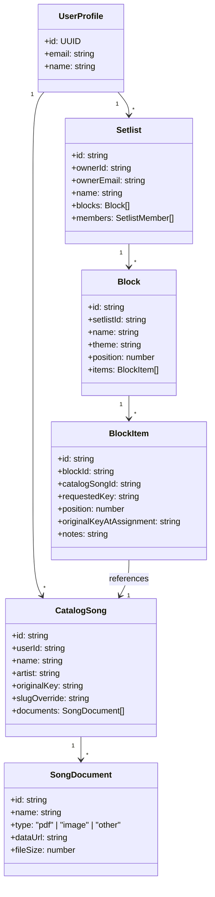

# Repertório Automático — Documentação do Aplicativo

Este documento serve como a documentação de referência oficial do **Repertório Automático**, detalhando a visão de produto, as regras do modelo de domínio, a arquitetura e as decisões técnicas implementadas no código.

---

## 1. Visão Geral do Produto

O **Repertório Automático** é um organizador e gerenciador de repertórios musicais *mobile-first* voltado para bandas, músicos solo e ministérios que hoje sofrem com a desorganização de pastas de cifras, planilhas ou blocos de notas. 

### Objetivos Principais
*   **Centralização**: Servir como ponto único de controle do repertório geral de um músico ou grupo.
*   **Agilidade em Ensaios/Apresentações**: Resolver instantaneamente as dúvidas de tons de execução de cada música ("Qual tom o vocalista pediu para esta apresentação?").
*   **Colaboração Simplificada**: Permitir que os integrantes de uma banda acessem, configurem e visualizem o setlist sincronizado.

### Limitação de Escopo
O aplicativo **não** armazena cifras internamente. Em vez disso, gera dinamicamente e gerencia links externos de cifra (Cifra Club) ou permite a anexação de arquivos de partituras/cifras próprias em formato PDF e imagem.

*   **Nome do App**: Repertório Automático
*   **Idioma**: Português Brasileiro (PT-BR)
*   **Padrão de Design**: Escuro por padrão (*Dark Mode*), com visual moderno, gradientes sutis e microinterações fluidas.

---

## 2. Modelo de Domínio

O domínio de negócios do aplicativo é estruturado em torno de três entidades centrais: **Catálogo**, **Setlist** e **Bloco**.



### 2.1. Catálogo Geral
É o acervo completo e privado de músicas cadastradas de cada usuário.
*   **Campos**: `nome`, `artista` (obrigatório para busca automatizada de cifras), `tom original` (texto livre, ex: "C", "Dó#m", "Sol maior").
*   **Organização**: Exibido em lista ordenada alfabeticamente. Suporta busca em tempo real por nome ou artista.
*   **Partituras e Anexos (Documentos)**:
    *   Cada música suporta a anexação de até **5 arquivos** (PDFs ou Imagens).
    *   Limite de tamanho: **10MB por arquivo**.
    *   Os anexos são armazenados localmente e na nuvem como base64 strings (`dataUrl`).
    *   O app disponibiliza um modal lightbox e visualizador integrado via `iFrame` (para PDFs) ou tags de imagem com ação de download.

### 2.2. Setlist
Uma coleção nomeada correspondente a um show, ensaio ou evento específico.
*   **Campos**: `nome` (único por usuário dono), `blocos`, `membros`.
*   **Duplicação**: Qualquer usuário proprietário ou convidado com acesso pode duplicar um setlist, gerando um clone inteiro sob sua propriedade (com blocos e músicas clonadas).
*   **Compartilhamento**: Apenas o dono pode convidar novos membros, excluir o setlist ou gerenciar permissões de acesso.

### 2.3. Bloco
Agrupamentos conceituais ou de ritmos organizados dentro de um setlist.
*   **Campos**: `nome` (não-vazio, único dentro do setlist), `tema` (texto livre), `posição`.
*   **Temas**: O tema digitado no bloco gera um *badge* visual com uma cor gerada de forma determinística por meio de um algoritmo de hash de string.
*   **Reordenação**: Suporta arrastar e soltar (drag & drop) para ordenar a sequência de blocos dentro do setlist.

### 2.4. Itens do Bloco (Referência de Música)
Relação entre uma música do catálogo e um bloco específico do setlist.
*   **Campos**: `música_id`, `tom solicitado` (opcional e texto livre), `notes` (observação opcional).
*   **Regras de Negócio**:
    *   O **tom solicitado vive na referência** e não no catálogo. Isso permite tocar a mesma música em tons diferentes dependendo da apresentação ou do cantor do dia.
    *   **Observações/Notas da Apresentação**: É possível adicionar uma observação de texto livre (ex: "Começa do solo de violão", "Crescente em colcheia") para a música na referência. Ela pode ser digitada no momento da adição ou editada inline no bloco focado.
    *   **Sem duplicação**: Não é permitido inserir a mesma música do catálogo duas vezes no mesmo bloco.
    *   Se o tom original for alterado no catálogo, o tom solicitado no bloco não é modificado, mas o item recebe uma badge discreta de atenção indicando que o tom original foi alterado.

---

## 3. Sincronização e Colaboração

O Repertório Automático é colaborativo por setlist, implementando regras de acesso baseadas em perfis.

### 3.1. Níveis de Permissão
*   **Owner (Dono)**: Acesso total. Exclui o setlist, convida/revoga integrantes, edita blocos, músicas e referências. Controla também a música correspondente no catálogo geral.
*   **Edit (Editor)**: Permissões de montagem. Adiciona/remove músicas de blocos, reordena itens, ajusta os tons solicitados das músicas e cria/exclui blocos dentro do setlist.
*   **View (Visualizador)**: Modo leitura. Apenas consulta a ordem do show, visualiza os tons solicitados, abre cifras e consulta arquivos/anexos de partituras.

### 3.2. Convites e Compartilhamento de Acesso
O aplicativo implementa dois métodos de compartilhamento de setlists:
1.  **Convite por E-mail**: O dono informa o e-mail do convidado. Se a conta já existe, o setlist é vinculado imediatamente. Se não, um convite de status pendente é criado, aguardando que o convidado crie sua conta para aceitá-lo/recusá-lo.
2.  **Links de Acesso Rápido & WhatsApp**:
    *   Na tela de perfil, o proprietário pode copiar um link direto de compartilhamento estruturado como `?setlist=SETLIST_ID&role=edit|view`.
    *   O app oferece um botão rápido para disparar o link preenchido em uma mensagem direta no WhatsApp.
    *   Ao acessar a aplicação através desse link, se o usuário estiver logado, o app faz a associação de associação automática (`joinSetlistViaLink`) adicionando o setlist à sua lista.

### 3.3. Edição Simultânea e Realtime
*   **Sincronização**: Conectado à rede do Supabase Realtime, mudanças de estrutura são sincronizadas em tempo real.
*   **Resolução de Conflitos**: Estrutura de campos independentes evita colisões comuns. Se dois editores salvarem o mesmo campo simultaneamente, aplica-se a regra de *Last-Write-Wins* (última escrita prevalece).

### 3.4. Arquitetura de Sincronização (Sync Layer)

O app implementa duas camadas complementares de sincronização com o Supabase para garantir consistência de dados mesmo em cenários offline:

#### Sincronização Explícita (Obrigatória)
Toda operação de escrita relevante (criar bloco, adicionar música, editar tom, mover item, convidar membro) executa `syncLocalDataToSupabase()` **imediatamente após** a mutação local. O resultado é exibido ao usuário via toast (sucesso ou erro). Essa camada substitui a dependência exclusiva do background sync, garantindo que nenhuma alteração relevante deixe de ser persistida na nuvem.

**Arquivos que implementam sync explícito**: `SetlistDetail.tsx`, `FocusedBlockView.tsx`, `SetlistsList.tsx`.

#### Sincronização Automática em Background (Fallback)
Toda alteração via `StorageEngine` dispara `triggerAutoBackgroundSync()` com debounce de 1200ms. O auto-sync verifica se um sync explícito já ocorreu nos últimos 3 segundos para evitar duplicação. Erros são logados no console, mas não interrompem o fluxo do usuário.

### 3.3. Edição Simultânea e Realtime
*   **Sincronização**: Conectado à rede do Supabase Realtime, mudanças de estrutura são sincronizadas em tempo real.
*   **Resolução de Conflitos**: Estrutura de campos independentes evita colisões comuns. Se dois editores salvarem o mesmo campo simultaneamente, aplica-se a regra de *Last-Write-Wins* (última escrita prevalece).

### 3.4. Arquitetura de Sincronização (Sync Layer)

O app implementa duas camadas complementares de sincronização com o Supabase para garantir consistência de dados mesmo em cenários offline:

#### Sincronização Explícita (Obrigatória)
Toda operação de escrita relevante (criar bloco, adicionar música, editar tom, mover item, convidar membro) executa `syncLocalDataToSupabase()` **imediatamente após** a mutação local. O resultado é exibido ao usuário via toast (sucesso ou erro). Essa camada substitui a dependência exclusiva do background sync, garantindo que nenhuma alteração relevante deixe de ser persistida na nuvem.

**Arquivos que implementam sync explícito**: `SetlistDetail.tsx`, `FocusedBlockView.tsx`, `SetlistsList.tsx`.

#### Sincronização Automática em Background (Fallback)
Toda alteração via `StorageEngine` dispara `triggerAutoBackgroundSync()` com debounce de 1200ms. O auto-sync verifica se um sync explícito já ocorreu nos últimos 3 segundos para evitar duplicação. Erros são logados no console, mas não interrompem o fluxo do usuário.

#### Estratégia de Merge na Inicialização
Ao carregar o app (`App.tsx`), dados remotos e locais são mesclados usando `updatedAt` como critério — o item mais recente vence. Após o merge, o resultado completo é enviado ao Supabase. Isso evita perda de dados offline e garante que dados locais não sincronizados (ex: blocos criados antes das correções) sejam enviados na primeira oportunidade.

#### Proteção de Ownership
Apenas o dono do setlist pode sincronizar blocos, músicas e membros para a nuvem. Setlists compartilhados dos quais o usuário não é dono são ignorados pelo sync, prevenindo blocos órfãos e violações de RLS.

#### Correção de Compartilhamento e RLS via Link (Julho 2026)
O sistema de convites e compartilhamento de setlists via link foi aprimorado com as seguintes soluções definitivas:
1. **Ativação de Link no Supabase (`enableSetlistLinkShare`)**: Ao clicar em "Copiar Link" ou "Enviar no WhatsApp", a aplicação insere um registro sentinela `__link_share__` na tabela `setlist_invites`.
2. **Políticas de RLS Atualizadas**: As políticas RLS do Supabase (`setlists_select`, `blocks_select`, `block_songs_select` e `songs_select_shared`) foram configuradas para validar a existência desse registro `__link_share__`. Isso libera o acesso de leitura para qualquer usuário autenticado que possua o link do setlist, bem como a leitura das músicas do setlist.
3. **Persistência de Membro no Convidado (`selfJoinSetlistAsMember`)**: Quando o convidado abre o link, o aplicativo executa `selfJoinSetlistAsMember()`, que faz a inserção direta do convidado na tabela `setlist_members` no Supabase. Isso contorna a limitação onde a sincronização em lote (`syncLocalDataToSupabase`) ignorava setlists dos quais o usuário logado não fosse o dono.

---


## 4. Integração de Cifras Externas

A geração e a renderização de cifras dependem da integração com o site **Cifra Club**.

### 4.1. Construção da URL de Cifra
A URL base é montada dinamicamente:
`https://www.cifraclub.com.br/{slug-artista}/{slug-musica}/`

*   **Slug Automatizada**: O texto do nome da música e do artista passa por um normalizador que remove acentos, retira caracteres não-alfanuméricos e substitui espaços por hifens.
*   **Customização (Slug Override)**: Caso a slug gerada não corresponda ao link correto no Cifra Club, o usuário pode configurar um `slugOverride` editando o campo diretamente no modal de cifras in-app ou no catálogo. **Inteligência ao colar links**: Se o usuário colar uma URL completa do Cifra Club no campo de slug, o app extrai automaticamente os slugs do artista e da música e os atualiza de forma apropriada, resolvendo o problema de cifras não encontradas.

### 4.2. Transposição Automatizada
O aplicativo calcula a distância de semitons relativos entre o **Tom Original** cadastrado no catálogo e o **Tom Solicitado** cadastrado na referência:
1.  Faz o mapeamento e tradução dos termos livres (ex: "Dó#" e "C#" viram índice `1`).
2.  Subtrai o índice do tom solicitado pelo original modulo 12.
3.  Calcula a mudança relativa na escala de `-6` a `+6` semitons (compatível com a transposição do Cifra Club).
4.  Acrescenta o parâmetro `?tom={N}` ao final do link da cifra para que ela já carregue transposta na tela.

### 4.3. Visualização com Fallback de Webview
As cifras são exibidas em um modal in-app que contém um `iframe`. 
*   **Tratamento de Bloqueio**: Como o Cifra Club restringe renderização em iFrames por cabeçalhos `X-Frame-Options` em certos dispositivos/navegadores, o app monitora falhas de renderização.
*   **Fallback**: Caso o carregamento falhe, exibe-se uma tela informativa recomendando que o usuário clique no botão para abrir a cifra diretamente em um navegador externo do sistema.

---

## 5. Interface, UX e Estado

### 5.1. Roteamento e Estrutura de Abas
O app utiliza uma navegação por abas na barra inferior (`BottomNav`) para gerenciar as rotas:
*   `ListMusic` (Setlists)
*   `Music` (Catálogo Geral)
*   `User` (Perfil de Usuário)

### 5.2. Padrões de Interação e UI
*   **Modais / Bottom Sheets**: Toda ação de criação e configuração (adicionar música, criar bloco, convidar integrante) é executada por modais suspensos, evitando redirecionamentos que tiram o músico do seu contexto.
*   **Edição Inline**: Nomes de setlists e tons solicitados podem ser editados com um clique simples sobre o texto, que se transforma em um campo de entrada e é atualizado ao pressionar Enter ou perder o foco.
*   **Desfazer Rápido (Undo)**: Exclusões pontuais (ex: retirar música do bloco) disparam um toast com duração de 5 segundos contendo um botão de "Desfazer".

### 5.3. PWA (Progressive Web App) e Offline
*   **Instalação**: O app se comporta como um aplicativo nativo no celular. O botão "Instalar" na aba de perfil monitora o evento `beforeinstallprompt` do navegador.
*   **Funcionamento Offline**: O aplicativo armazena todos os setlists ativos e catálogo em um cache local. Em caso de perda de conexão:
    *   Um banner persistente `OfflineBanner` surge no topo da tela.
    *   O app entra em modo de leitura offline estruturado, permitindo consultar a ordem e os tons das músicas sem acesso à internet, suspendendo novos salvamentos em nuvem.

### 5.4. Error Boundary e Resiliência
*   O componente raiz é envelopado por um `ErrorBoundary` global. Em caso de erro fatal de execução do React, o usuário visualiza uma tela de alerta amigável contendo um botão para recarregar a aplicação de forma limpa.

---

## 6. Arquitetura e Stack Técnica

A estrutura técnica do projeto baseia-se em uma arquitetura limpa focada em desempenho e sincronização background:

| Camada | Tecnologia |
|---|---|
| **Core Framework** | React 19 + TypeScript + Vite |
| **Banco de Dados & Auth** | Supabase (PostgreSQL + Auth + Realtime) |
| **Estilização** | Tailwind CSS v4 |
| **Biblioteca de Ícones** | Lucide React |
| **Animações** | Motion (Framer Motion) |
| **Gerenciamento de Estado** | Zustand (estado volátil de UI, toasts e modais) |
| **Mecanismo de Cache** | `StorageEngine` (abstração de `localStorage`) |
| **Métricas & Analytics** | Vercel Analytics (`@vercel/analytics`) |

### 6.1. Sincronização em Background (Debounce)
Sempre que uma modificação local é executada, o `StorageEngine` sinaliza um temporizador interno de background (`triggerAutoBackgroundSync` com debounce de **1200ms**). Caso o usuário esteja online e com credenciais Supabase válidas, os dados do localStorage são convertidos e enviados automaticamente para o banco remoto em lote de forma transparente.

### 6.2. Mapeamento de IDs Determinísticos (Helper `toUUID`)
No banco de dados Supabase (PostgreSQL), os registros utilizam tipos de chaves primárias `uuid`. A fim de permitir o funcionamento offline de criação com IDs simplificados (Ex: `song_01`, `setlist_01`), o app implementa a função `toUUID()`. Este helper cria um hash determinístico da string de entrada, garantindo que o mesmo ID de texto local resulte sempre em um UUID v4 compatível e idêntico para a inserção correta no banco de dados.

### 6.3. Esquema de Tabelas (Supabase SQL)
```sql
-- Perfis de Usuário
create table if not exists public.profiles (
  id uuid references auth.users on delete cascade primary key,
  display_name text not null default '',
  created_at timestamp with time zone default now() not null
);

-- Músicas do Catálogo
create table if not exists public.songs (
  id uuid default uuid_generate_v4() primary key,
  user_id uuid references public.profiles(id) on delete cascade not null,
  name text not null,
  artist text not null,
  original_key text not null default '',
  slug text not null default '',
  cifra_url text,
  documents jsonb default '[]'::jsonb,
  created_at timestamp with time zone default now() not null
);

-- Setlists
create table if not exists public.setlists (
  id uuid default uuid_generate_v4() primary key,
  user_id uuid references public.profiles(id) on delete cascade not null,
  name text not null,
  created_at timestamp with time zone default now() not null,
  updated_at timestamp with time zone default now() not null,
  unique(user_id, name)
);

-- Blocos
create table if not exists public.blocks (
  id uuid default uuid_generate_v4() primary key,
  setlist_id uuid references public.setlists(id) on delete cascade not null,
  name text not null,
  theme text not null default '',
  position integer not null default 0,
  created_at timestamp with time zone default now() not null
);

-- Músicas do Bloco (Referências)
create table if not exists public.block_songs (
  id uuid default uuid_generate_v4() primary key,
  block_id uuid references public.blocks(id) on delete cascade not null,
  song_id uuid references public.songs(id) on delete cascade not null,
  position integer not null default 0,
  requested_key text,
  notes text,
  created_at timestamp with time zone default now() not null,
  unique(block_id, song_id)
);

-- Migração caso a tabela já exista:
-- alter table public.block_songs add column if not exists notes text;

-- Integrantes do Setlist
create table if not exists public.setlist_members (
  id uuid default uuid_generate_v4() primary key,
  setlist_id uuid references public.setlists(id) on delete cascade not null,
  user_id uuid references public.profiles(id) on delete cascade not null,
  role text not null default 'viewer' check (role in ('owner', 'editor', 'viewer')),
  created_at timestamp with time zone default now() not null,
  unique(setlist_id, user_id)
);

-- Convites
create table if not exists public.setlist_invites (
  id uuid default uuid_generate_v4() primary key,
  setlist_id uuid references public.setlists(id) on delete cascade not null,
  inviter_id uuid references public.profiles(id) on delete cascade not null,
  invitee_email text not null,
  status text not null default 'pending' check (status in ('pending', 'accepted', 'declined')),
  created_at timestamp with time zone default now() not null
);
```


## Atualização de Branding e Autenticação (Julho 2026)
- Alteração da logo padrão para a logo oficial (preta sobre fundo branco em todas as telas).
- Correção das cores do Modal de Autenticação, padronizando com o roxo (purple-600) do app.
- Adição dos favicons e web manifests completos para PWA e navegadores.
- Script gerado e executado para salvar 17 músicas extraídas do cache local do usuário e inseridas diretamente na tabela Supabase.

## Correções de Responsividade e Estabilidade (Julho 2026)

### Bloco Focado — Nome das Músicas no Mobile
- Layout do cartão alterado de `flex items-center justify-between` para `flex flex-col md:flex-row md:items-center`.
- Mobile: `[01. Nome | Tom]` na linha 1, `[ações]` na linha 2 (com `border-t`).
- Desktop: `[01. Nome]` inline com `[Tom + ações]` (inalterado).
- Extraídos `ItemActionButtons` e `KeyBadgeDisplay` como sub-componentes para evitar duplicação de JSX.

### Bloco Focado — Remoção do Header Superior
- Removida a div de informações do bloco (`bg-slate-900/90`) que ocupava espaço excessivo no mobile.
- O nome do bloco já é exibido no canto superior direito (`Header.tsx`).
- Contagem de músicas e botão "Adicionar Música" movidos para o final da lista de músicas.
- Variável não utilizada `themeStyle` e import de `getThemeColorStyle` removidos.

### Visualização de Documentos (PDF / Imagens)
- **Upload**: Funcionalidade inalterada — até 5 arquivos (10MB cada), armazenados como `dataUrl` base64.
- **Preview de Imagens**: `` tag com `dataUrl`, funcionando consistentemente.
- **Preview de PDFs**: Corrigido de `dataUrl` direto no `<iframe>` para `Blob URL` via `dataUrlToBlobUrl()`, que tem compatibilidade muito superior no mobile (iOS Safari bloqueava data URIs em iframes).
- **Fallback**: Se o iframe de PDF falhar, exibe opção "Abrir Externamente" com fallback visual (mesmo padrão do CifraWebviewModal).
- **Clique na linha**: Toda a linha do documento é clicável para abrir preview, não apenas o ícone de olho.
- **Limpeza de memória**: `URL.revokeObjectURL()` ao fechar preview.
- CSP em `vercel.json` atualizado com `blob:` em `frame-src`.

### Service Worker (sw.js)
- Corrigido `event.respondWith(undefined)` no handler de fetch — o catch retornava `undefined` para recursos não cacheados que não fossem navegação (ex: Google Fonts), causando erro "passou promise com valor undefined".
- Agora retorna `new Response('Offline', { status: 503 })` como fallback.
- Log de erro de registro melhorado no `index.html`.

### Iframe de Cifras (CifraWebviewModal)
- Removido `allow-same-origin` do atributo `sandbox`. A combinação `allow-same-origin` + `allow-scripts` anula o isolamento do sandbox, gerando warning no console.

### Resiliência do Root DOM
- `main.tsx` agora verifica se o elemento `#root` existe antes de chamar `createRoot()`. Se não existir (causado por extensões como `spoofer.js` que removem o `#root` ou corrompem o contexto), o elemento é recriado antes da chamada.
- Corrige o React error #299 ("Target container is not a DOM element") que aparecia em produção em alguns navegadores com extensões instaladas.

### PWA — Nome do App e Instalação
- **`site.webmanifest`**: Corrigido de `"name":""` e `"short_name":""` (vazios, fazia o OS mostrar "Site") para `"name":"Repertório Automático"` e `"short_name":"Repertório"`.
- **Meta tags**: Adicionados `apple-mobile-web-app-title` e `application-name` no `index.html`.
- **Botão "Instalar App no Celular"**: Agora abre um modal com instruções detalhadas para Android (Chrome), iPhone/iPad (Safari) e Computador, em vez de um toast curto com mensagem cortada.
- Captura global do evento `beforeinstallprompt` antes do React montar para não perder o evento que dispara cedo.
- Detecta `display-mode: standalone` para informar quando o app já está instalado.

## Correções de Colaboração e Iframe (Julho 2026)

### Dashboard e Separação de Setlists
- Separação clara na lista de setlists (`SetlistsList.tsx`) entre "Meus Setlists" e "Compartilhados Comigo".
- Setlists compartilhados agora exibem o nome do dono original e o nível de permissão (View/Edit), com a remoção de botões destrutivos (Duplicar/Excluir) nessas visualizações.

### Sincronização de Membros On-Demand
- Adicionada a função `fetchSetlistMembers` no `supabase.ts` para buscar membros ativos de um setlist específico em tempo real.
- O owner agora visualiza, ao abrir o modal de compartilhamento, a lista atualizada de integrantes que acessaram via link, superando a limitação de exigir recarregamento do app para atualização.

### Escrita Colaborativa (Editor Member Sync)
- Implementada a função `syncMemberEditsToSupabase` no `supabase.ts` para permitir que usuários com permissão "Edit" salvem modificações na nuvem (adição de blocos, músicas e edição de tons/notas).
- Modificado o guard principal de sincronização para, quando o usuário não for o owner, acionar a sincronia via block-level changes em vez de upsert no setlist principal (que continua restrito ao owner).
- Elaboradas *Row Level Security (RLS) policies* específicas permitindo `insert/update` nas tabelas `blocks` e `block_songs` para usuários associados como "editor" no setlist.

### Estabilidade do Iframe CifraClub
- CifraClub frequentemente bloqueia iframes via `SameSite` / `X-Frame-Options`. 
- Adicionado fallback visual padrão em `CifraWebviewModal.tsx` recomendando "Abrir no Navegador" via `window.open` para garantir acesso ao conteúdo.
- O Iframe continua carregando em background; se conseguir (ex. com certas extensões), é renderizado e oculta o fallback, otimizando o fluxo sem quebrar a UI.
